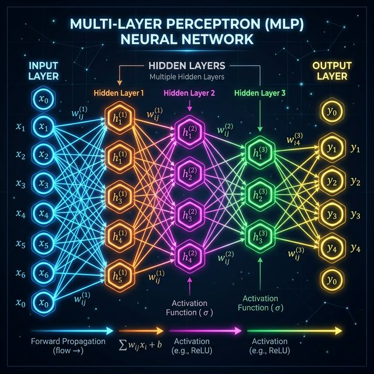

# 📋 Deep Learning (MLP) Revision Guide

Deep Learning uses artificial neural networks with multiple layers (hence 'Deep') to extract high-level features from data.

---

## ⚡ Concepts in this Folder

1. **Multilayer Perceptron (MLP)**: 
   - A feed-forward artificial neural network that consists of at least three layers of nodes: an input layer, a hidden layer, and an output layer.
   - Using **Sigmoid** or **ReLU** activation functions to introduce non-linearity.
2. **Workflow with TensorFlow/Keras**:
   - **Define Architecture**: `Sequential()` $\rightarrow$ `Dense()` layers.
   - **Compile Model**: Choose **Optimizer** (e.g., Adam) and **Loss Function** (e.g., binary_crossentropy).
   - **Fit Training Data**: Set **Epochs** and **Batch Size**.
   - **Evaluate & Predict**: Check accuracy and confusion matrices.
3. **Common Architectures**:
   - **Perceptron**: The simplest form, a single-layer neural network.
   - **Deep Neuarl Networks (DNN)**: Many hidden layers for complex feature extraction.

---

## 🛠️ Flow Structure

### Model Over-fitting Check:
- Use **Dropout** layers or **Regularization** to prevent the model from memorizing the noise in training data.
- **Early Stopping**: Stop training when the validation loss stops improving.
