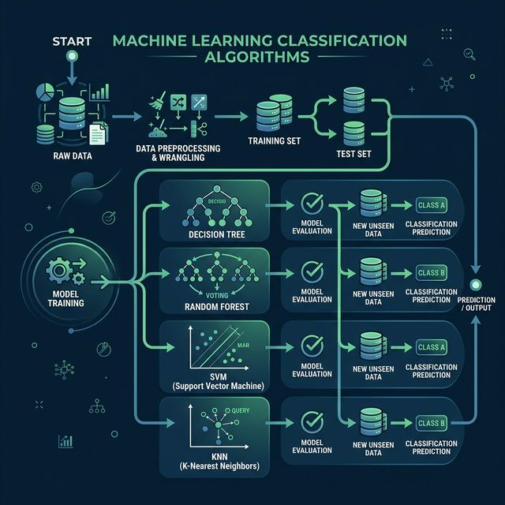

# 📋 Classification Algorithm Revision Guide

Classification is a sub-category of Supervised Learning where the goal is to predict a discrete label or category (class) for an input.

---

## ⚡ Algorithms in this Folder

1. **Random Forest**: 
   - Uses an ensemble of multiple decision trees to improve accuracy and control over-fitting.
   - Great for large datasets and identifying feature importance.
2. **SVM (Support Vector Machine)**:
   - Finds the optimal hyperplane that maximizes the margin between different classes.
   - Very effective for high-dimensional data and clear margins of separation.
3. **Decision Trees**:
   - A tree-like model that splits data based on feature values using criteria like Gini or Information Gain.
   - Highly interpretable but prone to over-fitting if not regulated.
4. **KNN (K-Nearest Neighbors)**:
   - A simple, instance-based algorithm that classifies points based on the majority vote of their 'k' closest neighbors.
   - Uses distance metrics like Euclidean or Manhattan.
5. **Logistic Regression**:
   - Despite its name, used for classification by applying a sigmoid function to a linear equation.
   - Excellent for binary outcomes and provides probabilities.

---

## 🛠️ Flow Structure

### Training Workflow:
1. **Data Load** $\rightarrow$ **Clean/Preprocess** $\rightarrow$ **Split (Train/Test)**
2. **Feature Selection** $\rightarrow$ **Fit Model** $\rightarrow$ **Validation**
3. **Prediction** $\rightarrow$ **Evaluation (Accuracy/F1-Score)**
