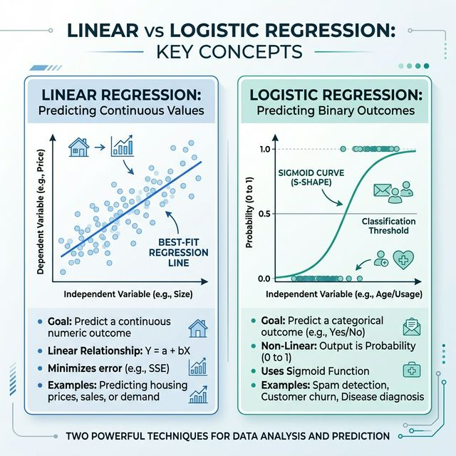

# 📋 Regression Algorithm Revision Guide

Regression is a Supervised Learning task where the goal is to predict a continuous numeric output (like price, temperature, or score).

---

## ⚡ Algorithms in this Folder

1. **Linear Regression**: 
   - Establish a linear relationship between input (X) and output (Y) by finding the best-fit line.
   - Equation: $Y = mx + c$
2. **Logistic Regression (Binary Regression/Classification)**:
   - Used specifically for binary outcomes by mapping outputs to probabilities (0 to 1) using a sigmoid curve.
   - Equation: $P(y=1|x) = \frac{1}{1 + e^{-z}}$
3. **Combined Models**:
   - Integrated exploratory analysis using Scaling and standardized data to produce more reliable predictions.

---

## 🛠️ Flow Structure

### Key Performance Indicators (KPIs):
- **Mean Absolute Error (MAE)**: Average of absolute differences.
- **Root Mean Squared Error (RMSE)**: Square root of the average squared errors.
- **R-squared ($R^2$)**: Explains how much variation in the dependent variable is captured by the model.
