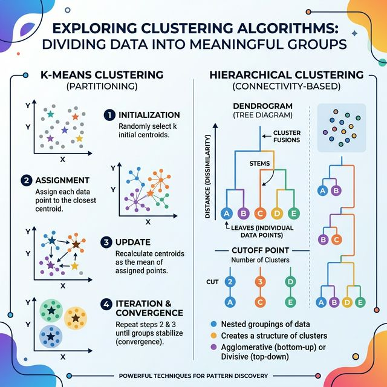

# 📋 Clustering Algorithm Revision Guide

Clustering is an Unsupervised Learning task where the goal is to group data points into 'clusters' based on similarity, without prior labeling.

---

## ⚡ Algorithms in this Folder

1. **K-Means Clustering**: 
   - An iterative algorithm that partions data into $K$ pre-defined clusters by minimizing within-cluster variance to the centroids.
   - Core steps: **Initialize** $\rightarrow$ **Assign** $\rightarrow$ **Update** $\rightarrow$ **Converge**.
2. **Agglomerative Hierarchical Clustering (Top-Down)**:
   - A bottom-up approach where each point starts as its own cluster and they are merged sequentially based on distance (Linkage).
   - Use **Dendrograms** to visualize hierarchical structures.
3. **Divisive Clustering (Bottom-Up)**:
   - A top-down approach that starts with one large cluster and iteratively splits it using KMeans or variance-based splitting.
   - Great for identifying large-scale structure before fine-grained clusters.

---

## 🛠️ Flow Structure

### Choosing the Optimal K ($K$):
- **Elbow Method**: Look for the "elbow" point in a plot of Within-Cluster Sum of Squares (WCSS) vs Number of Clusters.
- **Silhouette Score**: Measures how similar a point is to its own cluster compared to others.
